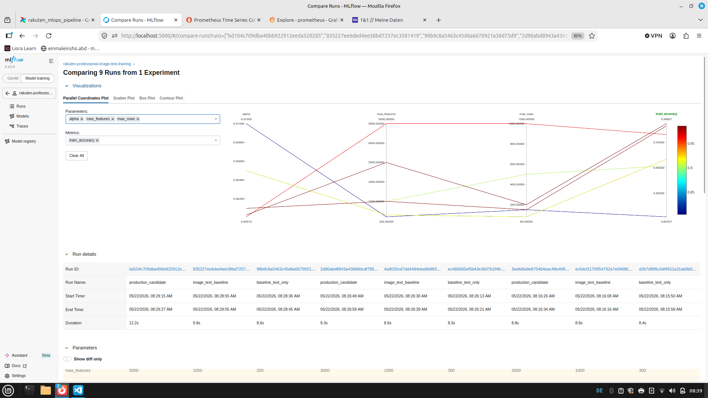
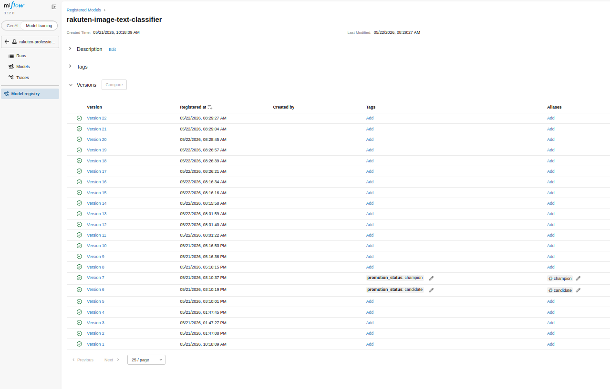
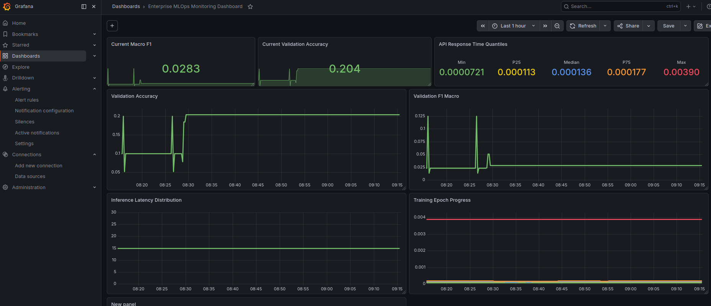
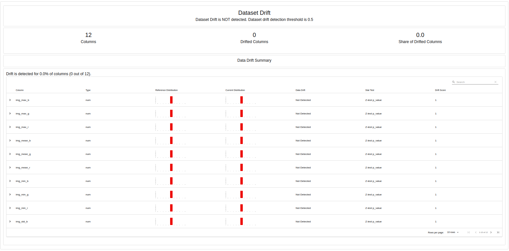

# Rakuten Product Classification — Enterprise MLOps Platform

Production-oriented end-to-end MLOps platform for multimodal e-commerce product classification using machine learning, experiment tracking, orchestration, monitoring and model governance workflows.

🌐 Website: https://mscisystems.com

---

# Project Overview

This project demonstrates a complete MLOps lifecycle for AI-powered product classification using the Rakuten e-commerce dataset.

The platform combines:

- product title classification
- product description understanding
- multimodal image-text workflows
- experiment tracking
- orchestration pipelines
- monitoring dashboards
- drift detection
- model governance and promotion

Instead of focusing only on model training, this project demonstrates how machine learning systems can be operationalized in production-style environments.

---

# Enterprise MLOps Stack

## Core ML Platform

- MLflow (Experiment Tracking & Model Registry)
- Apache Airflow (Pipeline Orchestration)
- FastAPI (Inference API)
- Docker Compose (Infrastructure & Containerization)

---

## Monitoring & Observability

- Prometheus (Metrics Collection)
- Pushgateway (Training Metrics Push)
- Grafana (Monitoring Dashboards)
- Evidently AI (Drift Detection & Data Quality Monitoring)

---

## Machine Learning

- scikit-learn
- TF-IDF Vectorization
- Multimodal Image + Text Classification
- Automated Model Evaluation
- Champion / Candidate Promotion Workflows

---

# Key Features

## End-to-End MLOps Workflow

- Automated training pipelines
- Multiple experiment runs
- Model comparison workflows
- Champion/Candidate promotion logic
- Drift detection reporting
- Monitoring dashboards
- Reproducible Docker infrastructure

---

## Experiment Tracking

MLflow is used for:

- parameter tracking
- metrics tracking
- artifact management
- model versioning
- registry management
- run comparison

---

## Model Governance

The platform includes automated:

- compare-and-promote orchestration
- champion model assignment
- candidate model assignment
- registry workflows
- scoring-based promotion logic

---

## Monitoring & Drift Detection

The monitoring stack provides:

- training metrics visualization
- validation accuracy monitoring
- F1-score monitoring
- inference latency tracking
- dataset drift detection
- data quality analysis

---

# Pipeline Workflow

The Airflow pipeline orchestrates:

1. Baseline text model training
2. Image-text model training
3. Production candidate training
4. Compare & Promote workflow
5. Drift report generation

---

# Architecture Overview

```text
                ┌──────────────────┐
                │   Raw Dataset    │
                └────────┬─────────┘
                         │
                         ▼
                ┌──────────────────┐
                │  Training Jobs   │
                │  (Airflow DAG)   │
                └────────┬─────────┘
                         │
                         ▼
                ┌──────────────────┐
                │     MLflow       │
                │ Experiment Store │
                └────────┬─────────┘
                         │
         ┌───────────────┴────────────────┐
         ▼                                ▼
┌──────────────────┐           ┌──────────────────┐
│  Model Registry  │           │  Drift Reports   │
│ Champion/Candidate│          │    Evidently     │
└────────┬─────────┘           └──────────────────┘
         │
         ▼
┌──────────────────┐
│ Monitoring Stack │
│ Grafana/Prometheus│
└──────────────────┘
```
---

# Monitoring Dashboard

The platform includes a professional monitoring stack with:

- validation accuracy dashboards
- macro F1 tracking
- training epoch monitoring
- latency monitoring
- operational metrics visualization

# Dataset

Rakuten Institute of Technology e-commerce classification dataset.

The dataset includes:

- product titles
- product descriptions
- product images
- category labels

A reduced sample dataset is included for demonstration purposes.

# Project Structure

rakuten-product-classification-mlops/

├── airflow_runtime/
│   └── dags/
│
├── data/
│   ├── sample/
│   └── processed/
│
├── docs/
│   └── screenshots/
│
├── prometheus/
│
├── src/
│   ├── api/
│   ├── data/
│   ├── features/
│   ├── models/
│   ├── monitoring/
│   └── utils/
│
├── docker-compose.yml
├── requirements.txt
├── README.md
└── .gitignore

# Eample Screenshots

## Airflow Orchestration

- DAG execution
- multi-stage ML pipelines
- orchestration workflows

## MLflow Experiment Tracking
- experiment comparison

- metrics tracking
- artifact management
- model registry workflows


## Grafana Monitoring

- AI monitoring dashboards
- operational metrics
- training observability

## Evidently Drift Detection

- dataset drift analysis
- feature distribution comparison
- monitoring reports

# Run Locally
## Start Infrastructure
docker compose up -d

## Services
### Service	URL
Airflow	http://localhost:8080
MLflow	http://localhost:5000
Grafana	http://localhost:3000
Prometheus	http://localhost:9090
Pushgateway	http://localhost:9091

# Future Improvements
- Kubernetes deployment
- CI/CD integration
- utomated retraining workflows
- cloud-native scaling
- GPU-based training pipelines
- advanced multimodal architectures

# Technologies

Python • MLflow • Airflow • FastAPI • Docker • Grafana • Prometheus • Evidently AI • scikit-learn • Machine Learning • MLOps • Monitoring • AI Infrastructure

## Author

Sonja Sungur
MSC Intelligent Systems
AI Systems Engineering • MLOps • Operational AI

🌐 https://mscisystems.com